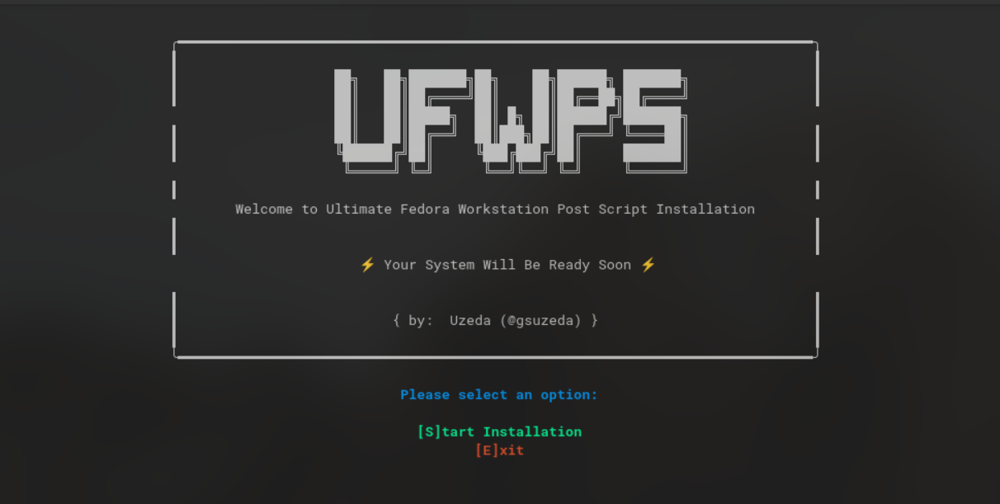

# Ultimate Fedora Workstation Post Script (UFWPS)

A powerful and user-friendly post-installation script for Fedora Workstation that helps you set up your system with optimal configurations, essential software, and performance tweaks.

<div align="center">
  
</div>

## 🚀 Features

### Repository Management
- Automatic RPM Fusion (free and nonfree) repository setup
- Multimedia codec repository configuration
- Optimized repository settings for better package management

### System Optimizatione
- Hardware acceleration setup for Intel and AMD processors
- Mesa driver optimization with freeworld drivers for better performance
- Custom TKG kernel installation with CPU-specific optimizations
- Performance mitigations management (optional)
- Battery optimization using TLP (for laptops)
- System update and firmware updates
- Faster boot time optimization
- Deep Sleep (S3) power management
- Dual boot timezone fix

### Desktop Environment
- GNOME extensions installation:
  - Blur My Shell
  - App Indicators Support
  - Tiling Assistant
  - Hide Top Bar
  - Clipboard Indicator
  - Caffeine
  - Fullscreen Notifications
  - Fuzzy App Search
  - Quick Settings Tweaks

### Theming
- Graphite GTK theme installation
- Papirus icon theme
- Custom wallpapers for light and dark modes
- Elegant GRUB theme with blur effect

### Hardware Support
- NVIDIA driver installation with CUDA support
- Advanced hardware acceleration support:
  - VA-API and VDPAU drivers
  - Intel Media Driver for 5th gen and newer
  - Mesa freeworld drivers for AMD
- OpenH264 codec support for Firefox
- Multimedia codecs and hardware acceleration

### System Cleanup
- Removal of unnecessary applications
- Optimization of startup services
- Configurable debloating options
- NetworkManager optimization

## 🛠️ Installation

1. Clone this repository:
```bash
git clone https://github.com/gsuzeda/UFWPS.git
```

2. Navigate to the directory:
```bash
cd UFWPS
```

3. Make the script executable:
```bash
chmod +x UFWPS.sh
```

4. Run the script:
```bash
./UFWPS.sh
```

## 🤝 Contributing

Feel free to contribute to this project! Here's how you can help:
- Fork the repository
- Create a new branch (`git checkout -b feature/improvement`)
- Make your changes
- Commit your changes (`git commit -am 'Add new feature'`)
- Push to the branch (`git push origin feature/improvement`)
- Create a Pull Request

## 📝 License

MIT License

Copyright (c) 2025 Uzeda (@gsuzeda)

Permission is hereby granted, free of charge, to any person obtaining a copy
of this software and associated documentation files (the "Software"), to deal
in the Software without restriction, including without limitation the rights
to use, copy, modify, merge, publish, distribute, sublicense, and/or sell
copies of the Software, and to permit persons to whom the Software is
furnished to do so, subject to the following conditions:

The above copyright notice and this permission notice shall be included in all
copies or substantial portions of the Software.

THE SOFTWARE IS PROVIDED "AS IS", WITHOUT WARRANTY OF ANY KIND, EXPRESS OR
IMPLIED, INCLUDING BUT NOT LIMITED TO THE WARRANTIES OF MERCHANTABILITY,
FITNESS FOR A PARTICULAR PURPOSE AND NONINFRINGEMENT. IN NO EVENT SHALL THE
AUTHORS OR COPYRIGHT HOLDERS BE LIABLE FOR ANY CLAIM, DAMAGES OR OTHER
LIABILITY, WHETHER IN AN ACTION OF CONTRACT, TORT OR OTHERWISE, ARISING FROM,
OUT OF OR IN CONNECTION WITH THE SOFTWARE OR THE USE OR OTHER DEALINGS IN THE
SOFTWARE.

## 📬 Contact

- GitHub: [@gsuzeda](https://github.com/gsuzeda)
- Telegram: [@Uzeda](https://t.me/Uzeda)

## 🙏 Acknowledgments

This project wouldn't be possible without the amazing work of these projects and their contributors:

- [Graphite GTK Theme](https://github.com/vinceliuice/Graphite-gtk-theme) by vinceliuice
- [Elegant GRUB Theme](https://github.com/vinceliuice/Elegant-grub2-themes) by vinceliuice
- [Papirus Icon Theme](https://github.com/PapirusDevelopmentTeam/papirus-icon-theme)
- [TLP](https://github.com/linrunner/TLP)
- [RPM Fusion](https://rpmfusion.org/)
- [Fedora 41 Post Install Guide](https://github.com/devangshekhawat/Fedora-41-Post-Install-Guide) by devangshekhawat
- [Mesa Freeworld Drivers](https://rpmfusion.org/Howto/Multimedia)
- [NVIDIA Drivers](https://rpmfusion.org/Howto/NVIDIA)
- [Quick Settings Tweaks](https://github.com/qwreey/quick-settings-tweaks)

Special thanks to all GNOME Extension developers and the Fedora community for their continuous contributions to making Linux better for everyone.

---
Made with ❤️ for the Fedora Community
